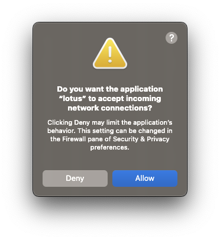
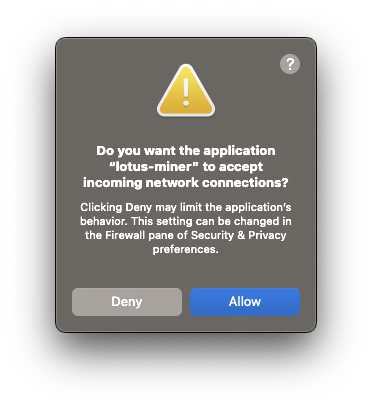

## Debian and Ubuntu

The following script has been written for Debian and Ubuntu distributions. Windows users _may_ be able to use this method combined with [WSL](https://docs.microsoft.com/en-us/windows/wsl/install), with some tweaking.

You must have Lotus installed. Checkout the [quick install guides]() if you don't have it installed yet.

There are two scripts to run here. Run the second script once the first script has finished. <!-- TODO: how does the user know that the script has finished? -->

```shell
#!/bin/bash

export LOTUS_PATH=~/.lotus-local-net
export LOTUS_MINER_PATH=~/.lotus-miner-local-net
export LOTUS_SKIP_GENESIS_CHECK=_yes_
export CGO_CFLAGS_ALLOW="-D__BLST_PORTABLE__"
export CGO_CFLAGS="-D__BLST_PORTABLE__"
export RUSTFLAGS="--cfg unsound_local_offset"

git clone https://github.com/filecoin-project/lotus lotus-local-net
cd lotus-local-net
git checkout experimental/fvm-m2

rm -rf ~/.genesis-sectors
make 2k

./lotus fetch-params 2048
./lotus-seed pre-seal --sector-size 2KiB --num-sectors 2
./lotus-seed genesis new localnet.json
./lotus-seed genesis add-miner localnet.json ~/.genesis-sectors/pre-seal-t01000.json

./lotus daemon --lotus-make-genesis=devgen.car --genesis-template=localnet.json --bootstrap=false
```

Once that script has finished, open a new terminal window on the same machine and run this script:

```shell
#!/bin/bash

export LOTUS_PATH=~/.lotus-local-net
export LOTUS_MINER_PATH=~/.lotus-miner-local-net
export LOTUS_SKIP_GENESIS_CHECK=_yes_
export CGO_CFLAGS_ALLOW="-D__BLST_PORTABLE__"
export CGO_CFLAGS="-D__BLST_PORTABLE__"

./lotus wallet import --as-default ~/.genesis-sectors/pre-seal-t01000.key
./lotus-miner init --genesis-miner --actor=t01000 --sector-size=2KiB --pre-sealed-sectors=~/.genesis-sectors --pre-sealed-metadata=~/.genesis-sectors/pre-seal-t01000.json --nosync
./lotus-miner run --nosync
```

## MacOS

The following scripts have been written for MacOS users.

You may get warning about `lotus` and `lotus-miner` accepting incoming connections. Click **Allow** on both of these prompts.

|  |   |
| --- | --- |

### Intel-based macs

This script is for Intel-based Macs only, and will not work for M1-based Macs. You must be using MacOS 11.0 _Big Sur_ or higher.

You must have Lotus installed already. Checkout the [quick install guides]() if you don't have it installed yet.

There are two scripts to run here. Run the second script once the first script has finished. <!-- TODO: how does the user know that the script has finished? -->

```shell
#!/usr/bin/env bash

```

### M1-based macs

This script is for M1-based Macs only and will not work for Intel-based Macs. You must be using MacOS 11.0 _Big Sur_ or higher. This script has not been tested on M2 CPUs, however it may still work.

You must have Lotus installed already. Checkout the [quick install guides]() if you don't have it installed yet.

There are two scripts to run here. Run the second script once the first script has finished. <!-- TODO: how does the user know that the script has finished? -->

```shell
#!/usr/bin/env bash

rm -rf ~/.genesis-sectors
rm -rf ~/.lotus-local-net

export LOTUS_PATH=~/.lotus-local-net
export LOTUS_MINER_PATH=~/.lotus-miner-local-net
export LOTUS_SKIP_GENESIS_CHECK=_yes_
export CGO_CFLAGS_ALLOW="-D__BLST_PORTABLE__"
export CGO_CFLAGS="-D__BLST_PORTABLE__"
export LIBRARY_PATH=/opt/homebrew/lib

git clone https://github.com/filecoin-project/lotus lotus-local-net
cd lotus-local-net
git checkout releases

make 2k

./lotus fetch-params 2048
./lotus-seed pre-seal --sector-size 2KiB --num-sectors 2
./lotus-seed genesis new localnet.json
./lotus-seed genesis add-miner localnet.json ~/.genesis-sectors/pre-seal-t01000.json
./lotus daemon --lotus-make-genesis=devgen.car --genesis-template=localnet.json --bootstrap=false
```

Once that script has finished, open a new terminal window on the same machine and run this script:

```shell
#!/usr/bin/env bash

rm -rf ~/.lotus-miner-local-net

export LOTUS_PATH=~/.lotus-local-net
export LOTUS_MINER_PATH=~/.lotus-miner-local-net
export LOTUS_SKIP_GENESIS_CHECK=_yes_
export CGO_CFLAGS_ALLOW="-D__BLST_PORTABLE__"
export CGO_CFLAGS="-D__BLST_PORTABLE__"
export LIBRARY_PATH=/opt/homebrew/lib

cd ./lotus-local-net

./lotus wallet import --as-default ~/.genesis-sectors/pre-seal-t01000.key
./lotus-miner init --genesis-miner --actor=t01000 --sector-size=2KiB --pre-sealed-sectors=~/.genesis-sectors --pre-sealed-metadata=~/.genesis-sectors/pre-seal-t01000.json --nosync
./lotus-miner run --nosync
```
