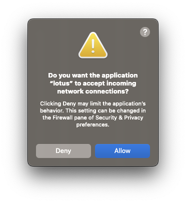
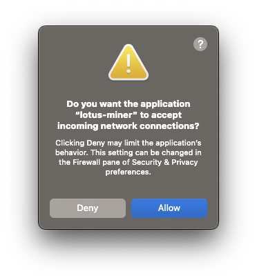

## Debian and Ubuntu

The following script has been written for Debian and Ubuntu distributions. Windows users _may_ be able to use this method combined with [WSL](https://docs.microsoft.com/en-us/windows/wsl/install), with some tweaking.


You must have Lotus installed already. Checkout the [quick install guides]() if you don't have it installed yet.


1. Save and run this script to set up the `lotus` daemon:

    ```shell
    #!/bin/bash

    # Set system variables for this terminal session.
    export LOTUS_PATH=~/.lotus-local-net
    export LOTUS_MINER_PATH=~/.lotus-miner-local-net
    export LOTUS_SKIP_GENESIS_CHECK=_yes_
    export CGO_CFLAGS_ALLOW="-D__BLST_PORTABLE__"
    export CGO_CFLAGS="-D__BLST_PORTABLE__"
    export RUSTFLAGS="--cfg unsound_local_offset"

    # Clone the Lotus repo and checkout to the experimental/fvm-m2 branch.
    git clone https://github.com/filecoin-project/lotus lotus-local-net
    cd lotus-local-net
    git checkout experimental/fvm-m2

    # Remove any pre-existing local-network setups.
    rm -rf ~/.genesis-sectors
    rm -rf ~/.lotus-local-net
    rm -rf ~/.lotus-miner-local-net

    # Make the 2K-Lotus binary.
    make 2k

    # Setup the local network and start the lotus daemon.
    ./lotus fetch-params 2048
    ./lotus-seed pre-seal --sector-size 2KiB --num-sectors 2
    ./lotus-seed genesis new localnet.json
    ./lotus-seed genesis add-miner localnet.json ~/.genesis-sectors/pre-seal-t01000.json
    ./lotus daemon --lotus-make-genesis=devgen.car --genesis-template=localnet.json --bootstrap=false
    ```

1. Once that script has finished, open a new terminal window on the same machine.
1. Save and run this script to set up the `lotus-miner`:

    ```shell
    #!/bin/bash

    # Set system variables for this terminal session.
    export LOTUS_PATH=~/.lotus-local-net
    export LOTUS_MINER_PATH=~/.lotus-miner-local-net
    export LOTUS_SKIP_GENESIS_CHECK=_yes_
    export CGO_CFLAGS_ALLOW="-D__BLST_PORTABLE__"
    export CGO_CFLAGS="-D__BLST_PORTABLE__"

    # Setup the SP and start the lotus-daemon.
    ./lotus wallet import --as-default ~/.genesis-sectors/pre-seal-t01000.key
    ./lotus-miner init --genesis-miner --actor=t01000 --sector-size=2KiB --pre-sealed-sectors=~/.genesis-sectors --pre-sealed-metadata=~/.genesis-sectors/pre-seal-t01000.json --nosync
    ./lotus-miner run --nosync
    ```

1. You're node should now be up and running.

## MacOS

The following scripts have been written for MacOS users. 


You must have Lotus installed already. Checkout the [quick install guides]() if you don't have it installed yet.


1. Save and run this script to set up the `lotus` daemon:

    ```shell
    #!/usr/bin/env bash

    # Check is system is Apple Silicon or Intel.
    if [[ $(uname -m) == 'arm64' ]] 
    then
        # Apple Silicon
        export LOTUS_PATH=~/.lotus-local-net
        export LOTUS_MINER_PATH=~/.lotus-miner-local-net
        export LOTUS_SKIP_GENESIS_CHECK=_yes_
        export CGO_CFLAGS_ALLOW="-D__BLST_PORTABLE__"
        export CGO_CFLAGS="-D__BLST_PORTABLE__"
        export LIBRARY_PATH=/opt/homebrew/lib
    else
        # Intel
    fi

    # Remove previous local-net setup, if one exists.
    rm -rf ~/.genesis-sectors
    rm -rf ~/.lotus-local-net
    rm -rf ~/.lotus-miner-local-net

    # Clone the Lotus repo and checkout to the fvm-m2 branch.
    git clone https://github.com/filecoin-project/lotus lotus-local-net
    cd lotus-local-net
    git checkout experimental/fvm-m2

    # Build the 2K-Lotus binary
    make 2k

    # Setup the local network and start the lotus daemon.
    ./lotus fetch-params 2048
    ./lotus-seed pre-seal --sector-size 2KiB --num-sectors 2
    ./lotus-seed genesis new localnet.json
    ./lotus-seed genesis add-miner localnet.json ~/.genesis-sectors/pre-seal-t01000.json
    ./lotus daemon --lotus-make-genesis=devgen.car --genesis-template=localnet.json --bootstrap=false
    ```

1. You may get warning about `lotus` accepting incoming connections. Click **Allow** on this prompt.

     

1. Once that script has finished, open a new terminal window on the same machine.
1. Save and run this script to set up the `lotus-miner`:

    ```shell
    #!/usr/bin/env bash

    # Check is system is Apple Silicon or Intel.
    if [[ $(uname -m) == 'arm64' ]] 
    then
        # Apple Silicon
        export LOTUS_PATH=~/.lotus-local-net
        export LOTUS_MINER_PATH=~/.lotus-miner-local-net
        export LOTUS_SKIP_GENESIS_CHECK=_yes_
        export CGO_CFLAGS_ALLOW="-D__BLST_PORTABLE__"
        export CGO_CFLAGS="-D__BLST_PORTABLE__"
        export LIBRARY_PATH=/opt/homebrew/lib
    else
        # Intel
    fi

    # Move into the lotus-local-net folder made in the last script.
    cd ./lotus-local-net


    # Setup the SP and start the lotus-daemon.
    ./lotus wallet import --as-default ~/.genesis-sectors/pre-seal-t01000.key
    ./lotus-miner init --genesis-miner --actor=t01000 --sector-size=2KiB --pre-sealed-sectors=~/.genesis-sectors --pre-sealed-metadata=~/.genesis-sectors/pre-seal-t01000.json --nosync
    ./lotus-miner run --nosync
    ```

1. You may get warning about `lotus-miner` accepting incoming connections. Click **Allow** on this prompt.

     

1. You're node should now be up and running.
